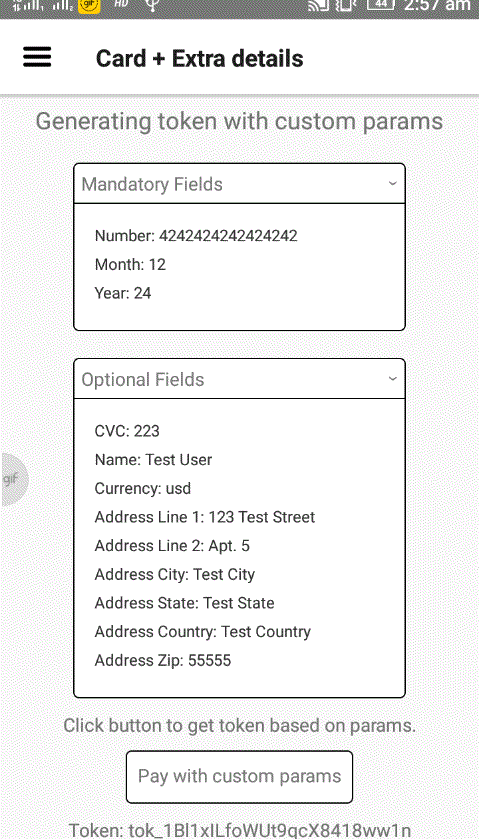
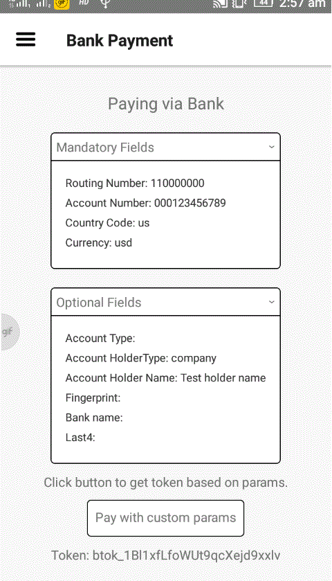

# Stripe Payment App: HPDF Team task
This project is made for the fulfillment of team task of Hasura HPDF.

This is based on tipsi-stripe, react-native, native-base and react-navigation libraries.

## Demo

Payment via car which checks simultaneously if card is valid, if not the colour changes to red.
 

Paying via card with extra details such as shipping address
 

Paying via Bank account
  

Checking card details, if its valid or not

 
