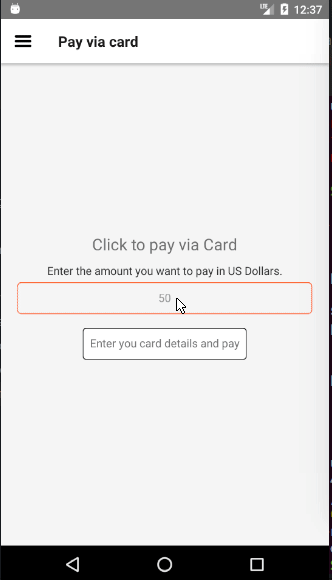
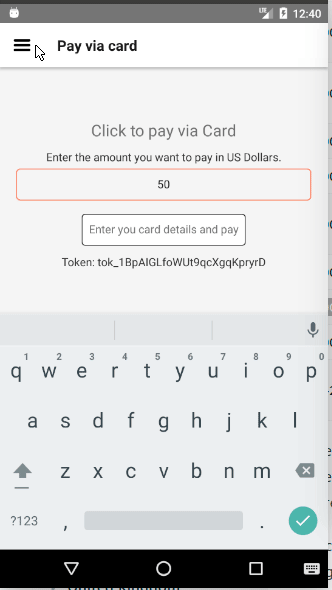
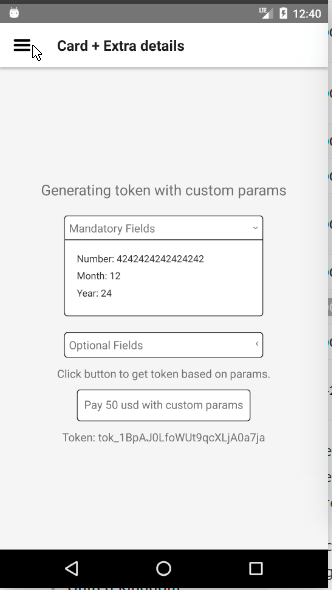
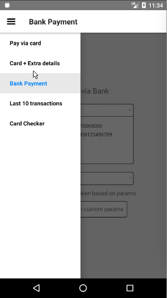
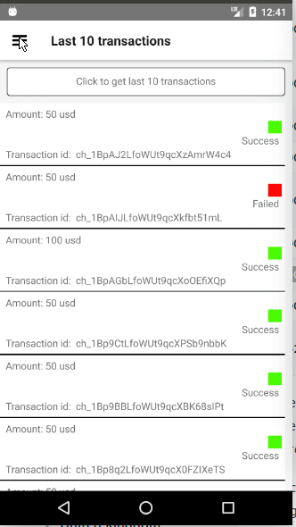

# Stripe Payment App: HPDF Team task
This project is made for the fulfillment of team task of Hasura HPDF.

This is based on tipsi-stripe, react-native, native-base and react-navigation libraries.

## Installing apk
You can download apk from [Google Drive](https://drive.google.com/open?id=1d7WRLniUEp1Yd7r16aq0Dlwjghcnu2TC) and install it to check directly.

## Cloning the project and running it yourself

On the command prompt run the following commands

```sh
$ git clone git@github.com:dvkcool/stripe-charge.git

$ cd stripe-charge/

$ npm install

$ react-native link

$ react-native bundle --platform android --dev false --entry-file index.android.js --bundle-output android/app/src/main/assets/index.android.bundle --assets-dest android/app/src/main/res

# To run in an emulator, make sure your emulator is running and then run following command
$ react-native run-android
```


## Demo
Payment via car which checks simultaneously if card is valid, if not the colour changes to red.

  -- 
 
 
 

Paying via card with extra details such as shipping address

 


Paying via Bank account

 


Gettings last 10 transaction, in which successful transaction is indicated woth a green colour indication and failed transaction is denoted by red indication. Also it contains the amount and transaction id of charge.



Also it contains a screen to check card details along with all necessary information such as expiry date and CVC.




