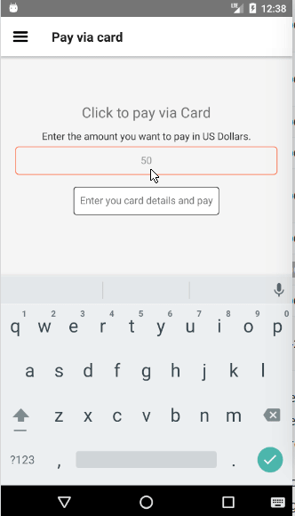

# Stripe Payment App: HPDF Team task

## What is it?
This project is a payment portal app built using [Stripe](https://stripe.com/gb), an international payment gateway.

This project is based on [tipsi-stripe](https://github.com/tipsi/tipsi-stripe), a community library for Sripe built for react-native.
This app can be used to make a payment using international cards or authenticated bank accounts, however it lacks support for some Indian bank accounts, so in-order to reccieve the payments the vendor account should be in some international bank instead of any banks of India.

## How it works
This app takes amount and card details from user and generate a token using Stripe, which is used to charge a card with some amount.
The previous transactions can also be seen with an option to view cause of failure of transaction.
It can handle most of errors while payment.

## Installing apk
You can download apk from [Google Drive](https://drive.google.com/open?id=1ozS1hb-w7_bxM40YxEywhPBKMJ1Cl_1S) and install it to check directly.

## Cloning the project and running it yourself

### Pre-requisites
We assume that you have following things installed and have basic knowledge of it
1. [npm](https://www.npmjs.com/) 
2. [react-native cli](https://facebook.github.io/react-native/)
3. [Android emulator](https://developer.android.com/studio/run/emulator.html)

On the command prompt run the following commands

```sh
$ git clone git@github.com:dvkcool/stripe-charge.git

$ cd stripe-charge/

$ npm install

$ react-native link

$ react-native bundle --platform android --dev false --entry-file index.android.js --bundle-output android/app/src/main/assets/index.android.bundle --assets-dest android/app/src/main/res

# To run in an emulator, make sure your emulator is running and then run following command
$ react-native run-android
```

## Want to build on top of this.
Head over to src folder and modify the necessary files.
Also you can employ us for some great interesting projects.

## Demo
Payment via car which checks simultaneously if card is valid, if not the colour changes to red.

  -- 
 
 
 

Paying via card with extra details such as shipping address

 


Paying via Bank account

 


Gettings last 10 transaction, in which successful transaction is indicated woth a green colour indication and failed transaction is denoted by red indication. Also it contains the amount and transaction id of charge.

Also if you want to check details of failure or success just click on any transaction to see the details.


Also it contains a screen to check card details along with all necessary information such as expiry date and CVC.


## Modifying the app
1. To modify the application, head over to src/Root.js to modify the main start page
2. To modify any particular screen head over to src/scenes/ And modify the necessary page.

## Got Struck or found a bug
Feel free to mail me  at [divyanshukumarg@gmail.com](divyanshukumarg@gmail.com) or raise an issue in this repository.


